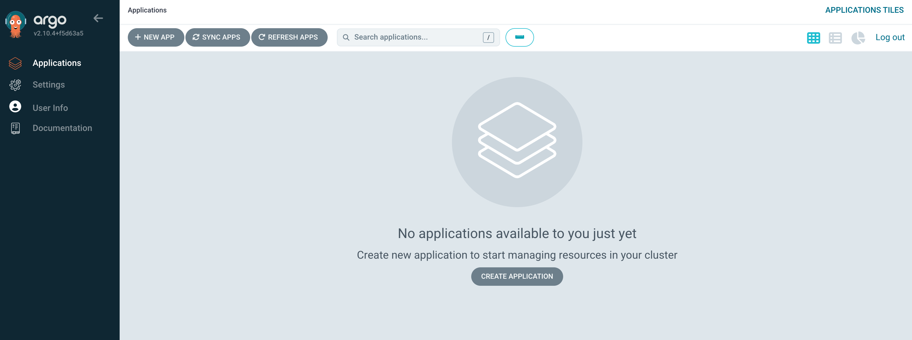

# DRAFT DOCUMENT!!

This is a document in progress!!

## Open items

* [x] ~~When we create the application Argo ask for namesapace but it add a sufix "-dev". For this reason at the moemnt all the steps are using "confluent-dev"~~ `The kustomize has a tag namespace and the value is confluent-dev`
* [x] When running "Run the LDAP search command" I have changed the hostname used of the DNS. ldap.**confluent-dev**.svc.cluster.local:389
* [ ] All host needs to be updated to the right domain **confluent-dev**. I have done this changes in the base file. This should be managed by kustomize
* [x] At the moment you need to install CFK manually. It can be done in the same application with two source. [Multiple Sources for an Application](https://argo-cd.readthedocs.io/en/stable/user-guide/multiple_sources/)

> Beta Feature. Specifying multiple sources for an application is a beta feature. The UI and CLI still generally behave as if only the first source is specified.

* [x] Using Sync Waves. A Syncwave is a way to order how Argo CD applies the manifests that are stored in git. All manifests have a wave of zero by default, but you can set these by using the argocd.argoproj.io/sync-wave [annotation](https://redhat-scholars.github.io/argocd-tutorial/argocd-tutorial/04-syncwaves-hooks.html).

```
metadata:
  annotations:
    argocd.argoproj.io/sync-wave: "5"
```

* [ ] auto-generated certificates. [Doc](https://docs.confluent.io/operator/current/co-network-encryption.html#configure-auto-generated-certificates) If that works I can remove the following Create TLS certificates
* [x] ~~Pre-work create ldap manually~~ **Manual Work**
* [x] ~~Error default replication factor is 3. We need to changes to 1...~~
* [ ] Secrests must be created manually Tls and users!
* [ ] kafka-server-domain.json this document is not using **confluent-dev**

# Overview
This repository contains the configuration files and setup instructions for deploying and managing [Project Name] using Kubernetes and related tools.

# Components

## Kubernetes
Kubernetes is an open-source platform designed to automate deploying, scaling, and operating application containers. It provides a robust infrastructure for deploying and managing containerized applications.

## ArgoCD
ArgoCD is a declarative, GitOps continuous delivery tool for Kubernetes. It automates the deployment of applications to Kubernetes clusters by using Git repositories as the source of truth for the desired state of the application.

## Sealed Secrets
Sealed Secrets is a Kubernetes controller and tool for managing encrypted Kubernetes Secrets using GitOps workflows. It allows for securely storing and managing sensitive information, such as API keys and passwords, within Git repositories.

## Kustomize
Kustomize is a template-free, GitOps-native configuration management tool for Kubernetes. It provides a simple yet powerful way to customize, patch, and manage Kubernetes resource configurations without the need for complex templating languages.

## GitHub
GitHub is a web-based hosting service for version control using Git. It provides collaboration features such as bug tracking, feature requests, task management, and wikis for every project.

## Confluent Kubernetes Operator
The Confluent Kubernetes Operator simplifies the deployment and management of Apache Kafka on Kubernetes. It automates the configuration and scaling of Kafka clusters, making it easier to run Kafka in Kubernetes environments.

## Steps

1. Donwload CFK
2. kubectl create namespace confluent-dev
3. Create LDAP
4. Create LDAP users
5. Create all Sectres
9. Create RBAC Rolebindings for Control Center admin
6. Setup Argo
7. Create application for operator
8. Create new argo application

# Install ArgoCD
ArgoCD can be installed using either kubectl or Helm. Choose one of the following methods:

## Using kubectl
```shell
kubectl create namespace argocd
kubectl apply -n argocd -f https://raw.githubusercontent.com/argoproj/argo-cd/stable/manifests/install.yaml
```
## Verify argo status

```console
kubectl get all -n argocd
```

The output will be similar to 

```console
NAME                                                    READY   STATUS    RESTARTS   AGE
pod/argocd-application-controller-0                     1/1     Running   0          2m18s
pod/argocd-applicationset-controller-7b9c4dfb77-j6j7z   1/1     Running   0          2m18s
pod/argocd-dex-server-9b5c6dccd-r9ndm                   1/1     Running   0          2m18s
pod/argocd-notifications-controller-756764ddd5-7vt26    1/1     Running   0          2m18s
pod/argocd-redis-69f8795dbd-7nqpm                       1/1     Running   0          2m18s
pod/argocd-repo-server-565fb47c89-49txx                 1/1     Running   0          2m18s
pod/argocd-server-86f64667bc-z29lc                      1/1     Running   0          2m18s

NAME                                              TYPE        CLUSTER-IP       EXTERNAL-IP   PORT(S)                      AGE
service/argocd-applicationset-controller          ClusterIP   10.111.117.180   <none>        7000/TCP,8080/TCP            2m18s
service/argocd-dex-server                         ClusterIP   10.108.32.9      <none>        5556/TCP,5557/TCP,5558/TCP   2m18s
service/argocd-metrics                            ClusterIP   10.102.142.243   <none>        8082/TCP                     2m18s
service/argocd-notifications-controller-metrics   ClusterIP   10.97.251.128    <none>        9001/TCP                     2m18s
service/argocd-redis                              ClusterIP   10.98.98.139     <none>        6379/TCP                     2m18s
service/argocd-repo-server                        ClusterIP   10.104.222.35    <none>        8081/TCP,8084/TCP            2m18s
service/argocd-server                             ClusterIP   10.109.35.157    <none>        80/TCP,443/TCP               2m18s
service/argocd-server-metrics                     ClusterIP   10.102.228.115   <none>        8083/TCP                     2m18s

NAME                                               READY   UP-TO-DATE   AVAILABLE   AGE
deployment.apps/argocd-applicationset-controller   1/1     1            1           2m18s
deployment.apps/argocd-dex-server                  1/1     1            1           2m18s
deployment.apps/argocd-notifications-controller    1/1     1            1           2m18s
deployment.apps/argocd-redis                       1/1     1            1           2m18s
deployment.apps/argocd-repo-server                 1/1     1            1           2m18s
deployment.apps/argocd-server                      1/1     1            1           2m18s

NAME                                                          DESIRED   CURRENT   READY   AGE
replicaset.apps/argocd-applicationset-controller-7b9c4dfb77   1         1         1       2m18s
replicaset.apps/argocd-dex-server-9b5c6dccd                   1         1         1       2m18s
replicaset.apps/argocd-notifications-controller-756764ddd5    1         1         1       2m18s
replicaset.apps/argocd-redis-69f8795dbd                       1         1         1       2m18s
replicaset.apps/argocd-repo-server-565fb47c89                 1         1         1       2m18s
replicaset.apps/argocd-server-86f64667bc                      1         1         1       2m18s

NAME                                             READY   AGE
statefulset.apps/argocd-application-controller   1/1     2m18s
```

## Get password

```console
kubectl -n argocd get secret argocd-initial-admin-secret -o jsonpath="{.data.password}" | base64 -d; echo
```

## Access ArgoCD UI
After installing ArgoCD, access the ArgoCD web UI using port-forwarding:
```console
kubectl port-forward svc/argocd-server -n argocd 8080:443
````

Then, open your web browser and navigate to http://localhost:8080. The user is admin and the password is the output of the step [above](get_password).



Further detail in the  following [link](https://apexlemons.com/devops/argocd-on-minikube-on-macos/)


## Create New argo application

### Create Application for helm

```yaml
apiVersion: argoproj.io/v1alpha1
kind: Application
metadata:
  name: operator
  annotations:
    argocd.argoproj.io/sync-wave: "1"
spec:
  destination:
    name: ''
    namespace: confluent-dev
    server: 'https://kubernetes.default.svc'
  source:
    path: ''
    repoURL: 'https://packages.confluent.io/helm'
    targetRevision: 0.824.40
    chart: confluent-for-kubernetes
  sources: []
  project: default
  syncPolicy:
    automated:
      prune: true
      selfHeal: true
    syncOptions:
    - ServerSideApply=true
```
execute

```shell
argocd login
argocd app create -f cfk-helm2.yaml
```

- [create LDAP](#deploy-openldap)
- [Create secrets](#create-tls-certificates)

### Create Application for infra

```yaml
apiVersion: argoproj.io/v1alpha1
kind: Application
metadata:
  name: cfk
  annotations:
  argocd.argoproj.io/sync-wave: "2"
spec:
  destination:
    name: ''
    namespace: confluent-dev
    server: 'https://kubernetes.default.svc'
  source:
    path: overlays/dev
    repoURL: 'https://github.com/sotojuan2/cfk-gitops'
    targetRevision: HEAD
  sources: []
  project: default
  syncPolicy:
    automated:
      prune: true
      selfHeal: true
```
execute
```shell
argocd app create -f cfk.yaml
```

# Security setup

In this workflow scenario, you'll set up a Confluent Platform cluster with the following security:

- Full TLS network encryption using both user provided certificates for external domains and auto-generated certs for internal domains
- mTLS authentication
- Confluent RBAC authorization

This scenario uses static host based routing with an ingress controller to provide external access to certain
REST based Confluent Platform components. View the [static host based routing scenario doc](https://github.com/confluentinc/confluent-kubernetes-examples/tree/master/networking/external-access-static-host-based) for a comprehensive walkthrough of that.

Before continuing with the scenario, ensure that you have set up the [prerequisites](https://github.com/confluentinc/confluent-kubernetes-examples/blob/master/README.md#prerequisites).

This scenario workflow requires the following CLI tools to be available on the machine you are using:

- openssl
- cfssl

## Set the current tutorial directory

Set the tutorial directory for this tutorial under the directory you downloaded the tutorial files:

```
export TUTORIAL_HOME=<Tutorial directory>/security/internal_external-tls_mtls_confluent-rbac
```

## Deploy OpenLDAP

This repo includes a Helm chart for [OpenLdap](https://github.com/osixia/docker-openldap). The chart `values.yaml`
includes the set of principal definitions that Confluent Platform needs for RBAC.

Deploy OpenLdap:

```
helm upgrade --install -f $TUTORIAL_HOME/assets/openldap/ldaps-rbac.yaml test-ldap $TUTORIAL_HOME/assets/openldap --namespace confluent-dev
```

Validate that OpenLDAP is running:

```
kubectl get pods --namespace confluent-dev
```

Log in to the LDAP pod:

```
kubectl --namespace confluent-dev exec -it ldap-0 -- bash

# Run the LDAP search command
ldapsearch -LLL -x -H ldap://ldap.confluent-dev.svc.cluster.local:389 -b 'dc=test,dc=com' -D "cn=mds,dc=test,dc=com" -w 'Developer!'

# Exit out of the LDAP pod
exit
```

## Create TLS certificates

In this scenario, you'll configure authentication using the mTLS mechanism. With mTLS, Confluent components and clients use TLS certificates for authentication. The certificate has a CN that identifies the principal name.

## Deploy configuration secrets

You'll use Kubernetes secrets to provide credential configurations.

With Kubernetes secrets, credential management (defining, configuring, updating)
can be done outside of the Confluent For Kubernetes. You define the configuration
secret, and then tell Confluent For Kubernetes where to find the configuration.

To support the above deployment scenario, you need to provide the following
credentials:

* Component TLS Certificates
* Authentication credentials for Zookeeper, Kafka, Control Center, remaining CP components
* RBAC principal credentials

In this scenario, you'll use both:

- auto-generated certificates for internal network encryption
- user provided certificates for external network encryption

### Configure auto-generated certificates

Confluent For Kubernetes provides auto-generated certificates for Confluent Platform
components to use for TLS network encryption. You'll need to generate and provide a
Certificate Authority (CA).

Generate a CA pair to use:

```
openssl genrsa -out $TUTORIAL_HOME/ca-key.pem 2048

openssl req -new -key $TUTORIAL_HOME/ca-key.pem -x509 \
  -days 1000 \
  -out $TUTORIAL_HOME/ca.pem \
  -subj "/C=US/ST=CA/L=MountainView/O=Confluent/OU=Operator/CN=TestCA"
```

Create a Kubernetes secret for the certificate authority:

```
kubectl create secret tls ca-pair-sslcerts \
  --cert=$TUTORIAL_HOME/ca.pem \
  --key=$TUTORIAL_HOME/ca-key.pem -n confluent-dev
```

### Provide external component TLS certificates for Kafka

In this scenario, you'll be allowing Kafka clients to connect with Kafka through the external-to-Kubernetes network.

For that purpose, you'll provide a server certificate that secures the external domain used for Kafka access.

```
# If you don't have one, create a root certificate authority for the external component certs
openssl genrsa -out $TUTORIAL_HOME/externalRootCAkey.pem 2048

openssl req -x509  -new -nodes \
  -key $TUTORIAL_HOME/externalRootCAkey.pem \
  -days 3650 \
  -out $TUTORIAL_HOME/externalCacerts.pem \
  -subj "/C=US/ST=CA/L=MVT/O=TestOrg/OU=Cloud/CN=TestCA"

# Create Kafka server certificates
cfssl gencert -ca=$TUTORIAL_HOME/externalCacerts.pem \
-ca-key=$TUTORIAL_HOME/externalRootCAkey.pem \
-config=$TUTORIAL_HOME/assets/certs/ca-config.json \
-profile=server $TUTORIAL_HOME/kafka-server-domain.json | cfssljson -bare $TUTORIAL_HOME/kafka-server
```

Provide the certificates to Kafka through a Kubernetes Secret:

```
kubectl create secret generic tls-kafka \
  --from-file=fullchain.pem=$TUTORIAL_HOME/kafka-server.pem \
  --from-file=cacerts.pem=$TUTORIAL_HOME/externalCacerts.pem \
  --from-file=privkey.pem=$TUTORIAL_HOME/kafka-server-key.pem \
  --namespace confluent-dev
```

### Provide authentication credentials

Create a Kubernetes secret object for Control Center.

This secret object contains file based properties. These files are in the
format that each respective Confluent component requires for authentication
credentials.

```
kubectl create secret generic credential \
  --from-file=basic.txt=$TUTORIAL_HOME/creds-control-center-users.txt \
  --from-file=ldap.txt=$TUTORIAL_HOME/ldap.txt \
  --namespace confluent-dev
```

### Provide RBAC principal credentials

Create a Kubernetes secret object for MDS:

```
kubectl create secret generic mds-token \
  --from-file=mdsPublicKey.pem=$TUTORIAL_HOME/assets/certs/mds-publickey.txt \
  --from-file=mdsTokenKeyPair.pem=$TUTORIAL_HOME/assets/certs/mds-tokenkeypair.txt \
  --namespace confluent-dev
   
# Kafka RBAC credential
kubectl create secret generic mds-client \
  --from-file=bearer.txt=$TUTORIAL_HOME/kafka-client.txt \
  --namespace confluent-dev
# Control Center RBAC credential
kubectl create secret generic c3-mds-client \
  --from-file=bearer.txt=$TUTORIAL_HOME/c3-mds-client.txt \
  --namespace confluent-dev
# Connect RBAC credential
kubectl create secret generic connect-mds-client \
  --from-file=bearer.txt=$TUTORIAL_HOME/connect-mds-client.txt \
  --namespace confluent-dev
# Schema Registry RBAC credential
kubectl create secret generic sr-mds-client \
  --from-file=bearer.txt=$TUTORIAL_HOME/sr-mds-client.txt \
  --namespace confluent-dev
# ksqlDB RBAC credential
kubectl create secret generic ksqldb-mds-client \
  --from-file=bearer.txt=$TUTORIAL_HOME/ksqldb-mds-client.txt \
  --namespace confluent-dev
# Kafka REST credential
kubectl create secret generic rest-credential \
  --from-file=bearer.txt=$TUTORIAL_HOME/kafka-client.txt \
  --from-file=basic.txt=$TUTORIAL_HOME/kafka-client.txt \
  --namespace confluent-dev
```

## Deploy Confluent Platform

Deploy Confluent Platform:

```
kubectl apply -f $TUTORIAL_HOME/confluent-platform-mtls-rbac.yaml --namespace confluent-dev
```

Check that all Confluent Platform resources are deployed:

```
kubectl get pods --namespace confluent-dev
```

If any component does not deploy, it could be due to missing configuration information in secrets.
The Kubernetes events will tell you if there are any issues with secrets. For example:

```
kubectl get events --namespace confluent-dev
Warning  KeyInSecretRefIssue  kafka/kafka  required key [ldap.txt] missing in secretRef [credential] for auth type [ldap_simple]
```

The default required RoleBindings for each Confluent component are created
automatically, and maintained as `confluentrolebinding` custom resources.

```
kubectl get confluentrolebinding --namespace confluent-dev
```

## Create RBAC Rolebindings for Control Center admin

Create Control Center Role Binding for a Control Center `testadmin` user.

```
kubectl apply -f $TUTORIAL_HOME/controlcenter-testadmin-rolebindings.yaml --namespace confluent-dev
```

# Configure External Access through Ingress Controller

The Ingress Controller will support TLS encryption. For this, you'll need to provide a server certificate
to use for encrypting traffic.

```
# Generate a server certificate from the external root certificate authority
cfssl gencert -ca=$TUTORIAL_HOME/externalCacerts.pem \
-ca-key=$TUTORIAL_HOME/externalRootCAkey.pem \
-config=$TUTORIAL_HOME/assets/certs/ca-config.json \
-profile=server $TUTORIAL_HOME/ingress-server-domain.json | cfssljson -bare $TUTORIAL_HOME/ingress-server

kubectl create secret tls tls-nginx-cert \
  --cert=$TUTORIAL_HOME/ingress-server.pem \
  --key=$TUTORIAL_HOME/ingress-server-key.pem \
  --namespace confluent-dev
```

## Install the Nginx Ingress Controller

```
# Add the Kubernetes NginX Helm repo and update the repo
helm repo add ingress-nginx https://kubernetes.github.io/ingress-nginx
helm repo update

# Install the Nginx controller
helm upgrade  --install ingress-nginx ingress-nginx/ingress-nginx
```

## Create Ingress Resources

Create internal bootstrap services for each Confluent Platform component that will round-robin route to each
components' server pods.

```
# Create Confluent Platform component bootstrap services
kubectl apply -f $TUTORIAL_HOME/connect-bootstrap-service.yaml
kubectl apply -f $TUTORIAL_HOME/ksqldb-bootstrap-service.yaml
kubectl apply -f $TUTORIAL_HOME/mds-bootstrap-service.yaml
```

Create an Ingress resource that includes a collection of rules that the Ingress controller uses to route the inbound
traffic to each Confluent Platform component. These will point to the bootstrap services created above.

In the resource file, `$TUTORIAL_HOME/ingress-service-hostbased.yaml`, replace `mydomain.com` with the value of your
external domain.

```
# Create the Ingress resource:
kubectl apply -f $TUTORIAL_HOME/ingress-service-hostbased.yaml
```

## Set up DNS

Create DNS records for Confluent Platform component HTTP endpoints using the ingress controller load balancer externalIP.

```
# Retrieve the external IP addresses of the ingress load balancer:
kubectl get svc
NAME                                 TYPE           CLUSTER-IP     EXTERNAL-IP       PORT(S)
...
ingress-nginx-controller             LoadBalancer   10.98.82.133   104.197.186.121   80:31568/TCP,443:31295/TCP
```

| DNS name                   | IP address                                                  |
| ---------------------------- | ------------------------------------------------------------- |
| controlcenter.mydomain.com | The`EXTERNAL-IP` value of the ingress load balancer service |
| connect.mydomain.com       | The`EXTERNAL-IP` value of the ingress load balancer service |
| ksqldb.mydomain.com        | The`EXTERNAL-IP` value of the ingress load balancer service |

## Validate

### Validate in Control Center

Use Control Center to monitor the Confluent Platform, and see the created topic
and data. You can visit the external URL you set up for Control Center, or visit the URL
through a local port forwarding like below:

Set up port forwarding to Control Center web UI from local machine:

```
kubectl port-forward controlcenter-0 9021:9021 --namespace confluent-dev
```

Browse to Control Center. You will log in as the `testadmin` user, with `testadmin` password.

```
https://localhost:9021
```

The `testadmin` user (`testadmin` password) has the `SystemAdmin` role granted and will have access to the
cluster and broker information.

### Validate component REST Access

You should be able to access the REST endpoint over the external domain name.

Use curl to access ksqldb cluster status. Provide the certificates you created to authenticate:

```
curl -sX GET "https://ksqldb.mydomain.com:443/clusterStatus" --cacert $TUTORIAL_HOME/externalCacerts.pem --key $TUTORIAL_HOME/kafka-server-key.pem --cert $TUTORIAL_HOME/kafka-server.pem
```

### Validate MDS Access

```
confluent login \
 --url https://mds.mydomain.com \
 --ca-cert-path $TUTORIAL_HOME/externalCacerts.pem
```

## Tear down

```
kubectl delete confluentrolebinding --all --namespace confluent-dev
  
kubectl delete -f $TUTORIAL_HOME/confluent-platform-mtls-rbac.yaml --namespace confluent-dev

kubectl delete secret rest-credential ksqldb-mds-client sr-mds-client connect-mds-client c3-mds-client mds-client --namespace confluent-dev

kubectl delete secret mds-token --namespace confluent-dev

kubectl delete secret credential --namespace confluent-dev

kubectl delete secret tls-kafka --namespace confluent-dev

helm delete test-ldap --namespace confluent-dev

helm delete operator --namespace confluent-dev
```

## Appendix: Troubleshooting

### Gather data to troubleshoot

```
# Check for any error messages in events
kubectl get events --namespace confluent-dev

# Check for any pod failures
kubectl get pods --namespace confluent-dev

# For pod failures, check logs
kubectl logs <pod-name> --namespace confluent-dev
```

