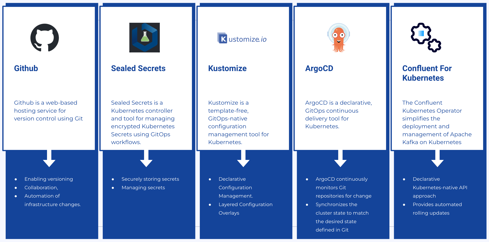

# Overview

This repository contains the configuration files and setup instructions for deploying and managing cfk-gitops using Kubernetes and related tools.

# Components

These are the components used for this repo.


## GitHub

GitHub is a web-based hosting service for version control using Git. It provides collaboration features such as bug tracking, feature requests, task management, and wikis for every project.

## Sealed Secrets

Sealed Secrets is a Kubernetes controller and tool for managing encrypted Kubernetes Secrets using GitOps workflows. It allows for securely storing and managing sensitive information, such as API keys and passwords, within Git repositories.

## Kustomize

Kustomize is a template-free, GitOps-native configuration management tool for Kubernetes. It provides a simple yet powerful way to customize, patch, and manage Kubernetes resource configurations without the need for complex templating languages.

## ArgoCD

ArgoCD is a declarative, GitOps continuous delivery tool for Kubernetes. It automates the deployment of applications to Kubernetes clusters by using Git repositories as the source of truth for the desired state of the application.

## Kubernetes

Kubernetes is an open-source platform designed to automate deploying, scaling, and operating application containers. It provides a robust infrastructure for deploying and managing containerized applications.

## Confluent Kubernetes Operator

The Confluent Kubernetes Operator simplifies the deployment and management of Apache Kafka on Kubernetes. It automates the configuration and scaling of Kafka clusters, making it easier to run Kafka in Kubernetes environments.


# Set the current tutorial directory

Set the tutorial directory for this tutorial under the directory you downloaded the tutorial files:

```
export TUTORIAL_HOME=<Tutorial directory>/security/internal_external-tls_mtls_confluent-rbac
```

# Nest steps

In data streaming systems, it's recommended to establish two types of pipelines:

The platform pipeline, overseen by Operators, is responsible for creating and maintaining the platform infrastructure and overseeing control plane resources.
In the following links you can find two ways to do it:
* [Using Sealed Secret.](./sealed_secret_README.md)
* [Without any Secret managament.](./No_sealed_secret_README.md)


On the other hand, the application pipeline, managed by developers, handles the building and deployment of applications, as well as the management of data plane resources, including topics, schemas, connectors, and business metadata.
You have an example of this pipeline:
* [ksql CI/CD pipeline.](https://github.com/sotojuan2/Ksqldb-CICD)


# Uses cases